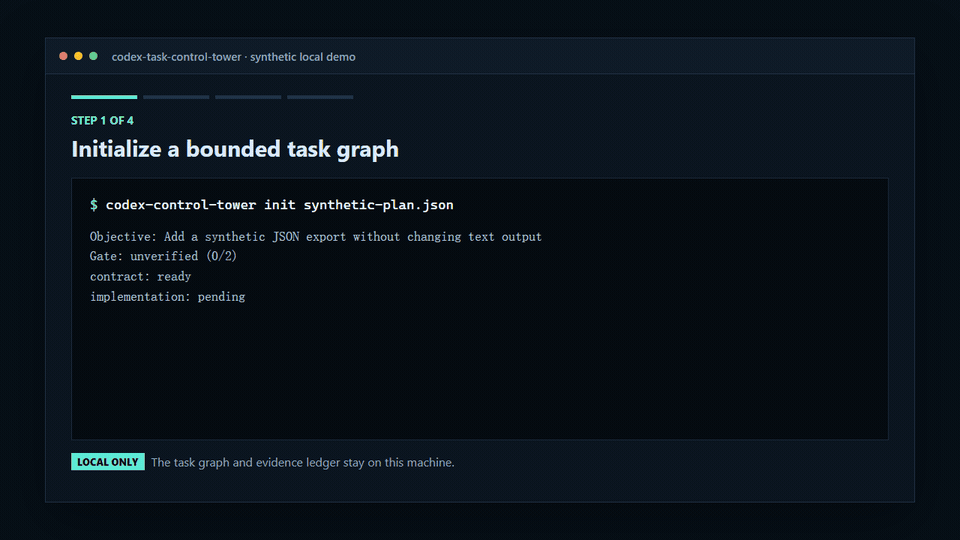

# Codex Task Control Tower

[](https://github.com/58254727-blip/codex-task-control-tower/actions/workflows/ci.yml)
[](https://github.com/58254727-blip/codex-task-control-tower/releases)
[](https://www.npmjs.com/package/codex-task-control-tower)
[](LICENSE)

[简体中文](README.zh-CN.md)

A local-first Codex plugin that guides one bounded software objective into a
small dependency graph, routes ready work to available Skills, controls
evidence-backed execution, verifies the outcome, and preserves privacy-safe
status and handoffs.

It was extracted as a generic open-source tool. The repository contains no production credentials, private task history, company data, or user-specific configuration.

The project has two deliberately separate layers:

- **Codex Skills** guide planning, Skill routing, execution decisions, status,
  verification, and handoff inside the active Codex task.
- A **runnable local CLI** persists a machine-readable task graph and evidence
  ledger, exposes ready work, stops equivalent repeated failures, evaluates the
  completion gate, and emits a sanitized handoff.

## Why This Exists

Long-running coding tasks often fail in predictable ways: an `active` label is
mistaken for progress, the same unsuccessful fix is retried, verification is
declared without evidence, and raw handoffs copy private paths or credentials.
This project turns those failure modes into explicit, inspectable state. It is
small enough to adopt without replacing an existing workflow and strict enough
to stop work when evidence or authority is missing.

## 60-second Demo

<p align="center">
  
</p>

The 38-second animation above is generated from the real local CLI with
synthetic data. It covers initialization, deterministic stall detection, the
evidence gate, and a handoff where private-looking sample fields are redacted.

Run the published CLI without cloning the repository:

```bash
npx --yes codex-task-control-tower@latest --help
```

Or run the complete repository demo and public-release checks:

```bash
git clone https://github.com/58254727-blip/codex-task-control-tower.git
cd codex-task-control-tower
npm ci
npm test
npm run demo
npm run validate:public
```

Then install the repository root through the Codex plugin interface and ask:

```text
Use execution-controller to complete this bounded software objective end to end.
```

`npm run demo` executes the real CLI from initialization through a passing gate
and sanitized handoff. See the [synthetic end-to-end demo](docs/demo.md) for the
commands and artifacts. The example is deliberately synthetic and contains no
private task history.

## Features

- **Development planner**: creates the smallest sufficient task graph with explicit dependencies, write scopes, success criteria, verification, and stop conditions.
- **Skill router**: selects one available primary Skill per task or records an honest no-Skill fallback.
- **Execution controller**: provides one end-to-end entry point that advances dependency-ready work, records evidence, and stops repeated failures safely.
- **Verification gate**: requires proof of the requested behavior, focused tests, relevant regressions, and applicable privacy or release checks.
- **Task control tower**: classifies tasks as `completed`, `in_progress`, `blocked`, or `unverified` using concrete evidence.
- **Stall detection**: distinguishes UI metadata from real progress and applies clear 20-minute and 30-minute thresholds.
- **Machine-readable timelines**: emits deterministic inactivity assessments and stable warning keys that consumers can de-duplicate.
- **Sanitized handoff**: preserves the objective, verified work, boundaries, blocker, and next safe step without copying raw conversations.
- **Local runtime CLI**: stores an inspectable JSON ledger, enforces dependency readiness and the two-equivalent-failure stop, returns meaningful exit codes, and writes sanitized Markdown handoffs.
- **Public-release validator**: scans text files for likely secrets, private identifiers, personal contact data, absolute paths, and invalid UTF-8.

This is not a background daemon. The Skills run only inside the active Codex
task and under the current runtime's tools, permissions, and user instructions.
The CLI records state but does not execute project commands or call a model. No
layer installs missing Skills or grants permission for deployment, publishing,
credentials, production data, or destructive actions. `task-control-tower`
remains read-only unless the user separately authorizes intervention.

## Install

Use the published zero-dependency CLI directly:

```bash
npx --yes codex-task-control-tower@latest --help
```

For a persistent global command:

```bash
npm install --global codex-task-control-tower
codex-control-tower --help
```

The published package is available on
[npm](https://www.npmjs.com/package/codex-task-control-tower). To install the
Codex Skills, clone or download this repository and install the repository root
through the Codex plugin interface. The plugin manifest is
`.codex-plugin/plugin.json`.

For local validation:

```bash
git clone https://github.com/58254727-blip/codex-task-control-tower.git
cd codex-task-control-tower
npm test
npm run demo
npm run validate:public
npm run verify:consumer
```

Node.js 18 or newer is required for the optional CLI, demo, validator, and
tests. The Skills themselves have no runtime dependency, and the CLI has no
third-party package dependency.

For an evidence-backed example of maintaining this repository itself, see the
[npm onboarding and trusted-publishing case study](docs/maintainer-case-study.md).

## Usage

Ask Codex to use the relevant skill:

```text
Use execution-controller to complete this bounded software objective end to end.
```

That entry point applies the planning, Skill routing, execution, and
verification contracts without requiring a separate prompt for every stage.

```text
Use task-control-tower to summarize these tasks from concrete evidence only.
```

```text
Use task-handoff to create a compact sanitized continuation record.
```

Templates are available in `templates/`.

For durable local evidence, use the optional CLI:

```bash
node bin/control-tower.mjs init examples/synthetic-plan.json
node bin/control-tower.mjs status
node bin/control-tower.mjs record --task contract --type complete --evidence "Focused synthetic contract test passed"
node bin/control-tower.mjs verify
node bin/control-tower.mjs handoff --output handoff.md
```

See the [CLI reference](docs/runtime-cli.md). State defaults to the ignored
`.control-tower/` directory and stays on the local machine.

The six bundled Skills are:

- `execution-controller`
- `development-planner`
- `skill-router`
- `verification-gate`
- `task-control-tower`
- `task-handoff`

## Privacy

- No network service, MCP server, hook, telemetry, or API key is included.
- Planning and routing never create authority for external side effects.
- Local ledger files can contain raw evidence and must not be committed; only a reviewed sanitized handoff is suitable for sharing.
- The validator never prints matched secret content; it reports only file, line, and rule.
- The only credential-like fixture is deliberately synthetic and explicitly allowlisted for scanner tests.
- Real credentials, private data, raw conversations, internal addresses, and unnecessary identifiers must never be committed.

## Development

```bash
npm test
npm run demo
npm run validate:public
npm pack --dry-run
```

See [CONTRIBUTING.md](CONTRIBUTING.md), [ROADMAP.md](ROADMAP.md),
[SECURITY.md](SECURITY.md), the [changelog](CHANGELOG.md), and the
[public release checklist](docs/public-release-checklist.md). Platform,
packaged-install, plugin-manifest, and Skill-validator results are recorded in
the [compatibility matrix](docs/compatibility.md).

## License

MIT
